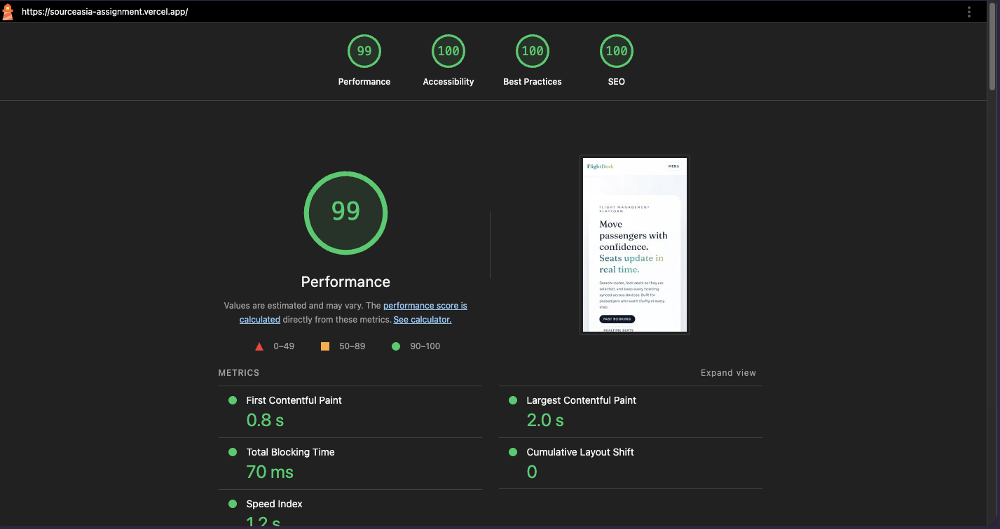

# FlightDesk

FlightDesk is a flight management web app for searching flights, reserving seats in real time, and managing bookings (reschedule/cancel). It uses Next.js App Router with Supabase (Postgres + Auth + Realtime), Zustand, and Tailwind.

## Setup

1. Install dependencies.

```bash
npm install
```

2. Create a local `.env` file.

```bash
cp .env.example .env
```

3. Fill the Supabase values in `.env` (see .env.example).

```
NEXT_PUBLIC_SUPABASE_URL=
NEXT_PUBLIC_SUPABASE_ANON_KEY=
SUPABASE_SERVICE_ROLE_KEY=
```

## Supabase project setup

1. Create a new Supabase project.
2. Apply the SQL migrations in order:
   - supabase/migrations/001_init.sql
   - supabase/migrations/002_reschedule_rpc.sql
   - supabase/migrations/003_realtime_seats.sql
3. Run the seed file:
   - supabase/seed/seed.sql
4. Enable Realtime for the `seats` table in Supabase Dashboard.

## Test user (seeded)

- Email: test.user@demo.com
- Password: Passw0rd!

## Run locally

```bash
npm run dev
```

Open http://localhost:3000.

## Zustand store structure

### useFlightStore

- `searchQuery`: active search inputs
- `selectedFlight`: selected flight details
- `selectedSeat`: selected seat details
- `bookingStep`: flow status
- `passengerForm`: passenger input state
- `resetBooking`: clears booking state

The store uses `persist` with `partialize` so `passportNo` never lands in localStorage.

### useUserStore

- `session`: cached auth session token
- `cachedBookings`: optional cache for offline list view
- `resetUser`: clears user state on logout

Only the `session` is persisted.

## PWA notes

- Manifest at public/manifest.json
- Icons at public/icons/icon-192.png and public/icons/icon-512.png
- Offline fallback at /offline
- Install prompt shows on mobile when available

## Testing checklist

- Search route works and shows flights
- Booking flow completes with PNR and seat
- Realtime seat updates in two tabs
- Reschedule updates booking and logs reschedule
- Cancel blocks within 2 hours of departure
- Zustand persists search/seat, excludes passport
- Lighthouse PWA score >= 90 (bonus)

## Deployment

Preview URL: https://sourceasia-assignment.vercel.app/

Lighthouse PWA screenshot: public/docs/lighthouse-pwa.png


